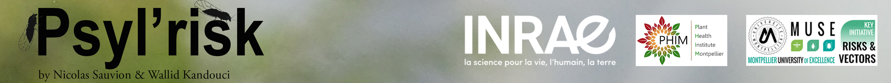

 

# Bienvenue !

Bienvenue sur le site **Psyl'risk** où nous mettons à disposition toutes les informations nécessaires sur nos psylles.

En cliquant sur les onglets de gauches:

* **Visualisation::** visualiser nos données récoltées sur nos sites et comparer nos données récoltées sur plusieurs années grace à nos graphiques interactifs.
* **Galerie:** de belles images prises sur le terrain.
* **Maps:** cartes géographiques où il est possible de visualiser le positionnement de nos bassins, ainsi qu'une seconde carte ou il est possible de visualiser l'occurrence de nos psylles collectés qui se divise en deux espèces **A** et **B**.
* **Données Météo:** les données météo utilisées pour notre étude sur l'évolution de nos psylles, ces données sont mises à disposition gratuitement par Météo France et elles sont accessibles https://www.data.gouv.fr/fr/reuses/code-r-de-recuperation-des-donnees-synop-meteo-france/ .
* **Données du laboratoire (2005):** visualiser les données d'une étude sur nos psylles faites en 2005 afin d'étudier leurs dynamiques. Les courbes obtenues sont le résultat d'un modèle dit IPLM qui nous a permis de faire nos courbes de développement en fonction des températures enregistrées lors de cette année 2005.
* **Code R:** ici toutes les informations sur le modèle dit IPLM utilisé pour l'étude du taux de développement de nos psylles en fonction des températures.
* **Contact:** Nicoals Sauvion & Walid Kandouci.
* **Sources:** liste d'articles publiée par Nicolas Sauvion en relation avec nos psylles.

# Qui sommes nous ?

 

Nicolas Sauvion - Ingénieur de recherche INRAE 

 

Walid Kandouci - Master 2 Biostatistique, Université Montpellier 2 

