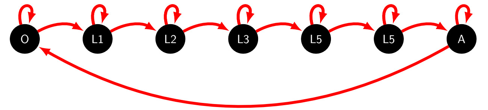

# Data Laboratoire 2005

Afin de modéliser le taux de développement de nos psylles en fonction des températures, les données 2005 ont été conçus. Ce sont des données récoltées au **CIRAD Montferrier-sur-lez** sous des conditions climatiques réelles et qui ont pour but d'observer l'évolution des psylles du stade oeuf jusqu'au stade jeune adulte dit “imago”.

 

Représentation graphique des différents stades de développement de nos psylles

Un modèle dit **"PIML"** a été utilisé afin d'illustrer les courbes qui montrent le taux de développement en fonction des températures.

*plus d'informations sur le modèle IPLM sur les onglets “code R” ainsi que "Sources"*